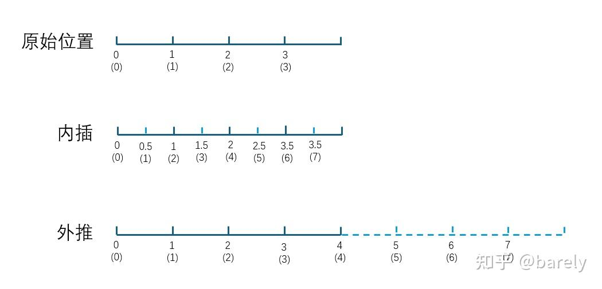

## RoPE编码

> https://arxiv.org/abs/2104.09864

#### 思路:

通过绝对位置编码的方式实现相对位置编码:

假设位置编码函数为:
$$
q_m =f(q, m)\\
k_n=f(k,n)
$$

$m,n$为位置坐标，$q,k$为对应位置的向量表示。

RoPE希望$q_m$与$k_n$之间的点积，即$f(q,m)\cdot f(k,n)$中能够带有相对位置信息 。

即能表达为如下形式:
$$
f(q,m)\cdot f(k,n)=g(q,k,m-n)
$$
**Sinusoidal位置编码 **

Sinusoidal位置编码是谷歌在Transformer模型中提出的一种绝对位置编码，它的形式如下，其中 d 表示词向量的维度， $k$ 表示位置索引， 2i 和 2i+1 表示位置向量的分量索引，例如 $p_{k,2i} $和$ p_{k,2i+1} $分别表示位置 k 的位置向量的第 $2i$ 和第 $2i+1$ 个分量：
$$
\left\{\begin{array}{l}\boldsymbol{p}_{k, 2 i}=\sin (k / 10000^{2 i / d}) \\ \boldsymbol{p}_{k, 2 i+1}=\cos \left(k / 10000^{2 i / d}\right)\end{array}\right.\\
$$


从该位置编码的数学形式来看，这是一个具有周期性的三角函数式位置编码。该设计具有一些有趣的性质，并且在本文要介绍的RoPE位置编码中也可以看到它的身影。

Sinusoidal位置编码的每个分量都是正弦或余弦函数，所有每个分量的数值都具有**周期性**。如下图所示，每个分量都具有周期性，并且越靠后的分量，波长越长，频率越低。这是一个非常重要的性质，基于RoPE的大模型的长度外推工作，与该性质有着千丝万缕的关联，后续我们会进行分享。


#### 具体方法


借助**旋转矩阵** 来进行处理
$$
f(q, m)=R_mq=\left(\begin{array}{cc}\cos m \theta & -\sin m \theta \\ \sin m \theta & \cos m \theta\end{array}\right)\left(\begin{array}{l}q_0 \\ q_1\end{array}\right)\\
$$
上面公式为维度为2的情况，扩展到多维时：


$$
\left(\begin{array}{ccccccc}\cos m \theta_0 & -\sin m \theta_0 & 0 & 0 & \cdots & 0 & 0 \\ \sin m \theta_0 & \cos m \theta_0 & 0 & 0 & \cdots & 0 & 0 \\ 0 & 0 & \cos m \theta_1 & -\sin m \theta_1 & \cdots & 0 & 0 \\ 0 & 0 & \sin m \theta_1 & \cos m \theta_1 & \cdots & 0 & 0 \\ \vdots & \vdots & \vdots & \vdots & \ddots & \vdots & \vdots \\ 0 & 0 & 0 & 0 & \cdots & \cos m \theta_{d / 2-1} & -\sin m \theta_{d / 2-1} \\ 0 & 0 & 0 & 0 & \cdots & \sin m \theta_{d / 2-1} & \cos m \theta_{d / 2-1}\end{array}\right)\left(\begin{array}{c}q_0 \\ q_1 \\ q_2 \\ q_3 \\ \vdots \\ q_{d-2} \\ q_{d-1}\end{array}\right)
$$
上式中的旋转矩阵十分稀疏，为了节省算力，可以以下面的方式等效实现：
$$
\left(\begin{array}{c}q_0 \\ q_1 \\ q_2 \\ q_3 \\ \vdots \\ q_{d-2} \\ q_{d-1}\end{array}\right) \otimes\left(\begin{array}{c}\cos m \theta_0 \\ \cos m \theta_0 \\ \cos m \theta_1 \\ \cos m \theta_1 \\ \vdots \\ \cos m \theta_{d / 2-1} \\ \cos m \theta_{d / 2-1}\end{array}\right)+\left(\begin{array}{c}-q_1 \\ q_0 \\ -q_3 \\ q_2 \\ \vdots \\ -q_{d-1} \\ q_{d-2}\end{array}\right) \otimes\left(\begin{array}{c}\sin m \theta_0 \\ \sin m \theta_0 \\ \sin m \theta_1 \\ \sin m \theta_1 \\ \vdots \\ \sin m \theta_{d / 2-1} \\ \sin m \theta_{d / 2-1}\end{array}\right)\\
$$


#### 代码实现

```python
import torch
base = 10000 # 
dim = 8
seqlen = 16

# 生成token对应下标
t = torch.arange(seqlen)
# 按照2i，即步长为2生成对应维度的偏转角度，例如维度为8->[0, 2, 4, 6]
freqs = 1.0 / (base ** (torch.arange(0, dim, 2, dtype=torch.float32) / dim))
# 将下标和偏转角度向量的外积 ->C[i][j] = a[i] * b[j]
freqs = torch.outer(t, freqs)
# 将freqs转换为模为1，角度转换为极坐标（幅度和角度）的复数形式
freqs_cis = torch.polar(torch.ones_like(freqs), freqs)

#随机初始化输入向量 bs=2 seq_length=14 n_head=4 head_dim=8
x = torch.rand((2, 16, 4, 8))

def apply_rotary_emb(x: torch.Tensor, freqs_cis: torch.Tensor) -> torch.Tensor:
    dtype = x.dtype
    # 先将head_dim转换为 将相邻维度生成新的维度 [a1,a2,a3,a4]->[[a1,a2],[a3,a4]]
    # 将head_dim向量维度转换为复数形式[[a1,a2],[a3,a4]]->[a1+ia2, a3+ia4]
    x = torch.view_as_complex(x.float().view(*x.shape[:-1], -1, 2))
    freqs_cis = freqs_cis.view(1, x.size(1), 1, x.size(-1))
    y = torch.view_as_real(x * freqs_cis).flatten(3)
    return y.to(dtype)
y = apply_rotary_emb(x, freqs_cis)
```

**transformers实现**

```python
import torch
from typing import Optional
rope_theta = 1000000.0 
partial_rotary_factor = 1.0
hidden_size = 32
num_attention_heads = 4
dim = hidden_size//num_attention_heads
max_seq_length = 16
batch_size = 2
device = "cpu"
head_dim = hidden_size//num_attention_heads

inv_freq = 1.0 / (base ** (torch.arange(0, dim, 2, dtype=torch.int64).to(device=device, dtype=torch.float) / dim))

hidden_states = torch.rand((batch_size, max_seq_length, num_attention_heads,hidden_size//num_attention_heads)).transpose(1, 2)
position_ids = torch.arange(max_seq_length).unsqueeze(0) # shape [max_seq_length]

inv_freq_expanded = inv_freq[None, :, None].float().expand(position_ids.shape[0], -1, 1)
position_ids_expanded = position_ids[:, None, :].float()
freqs = (inv_freq_expanded.float() @ position_ids_expanded.float()).transpose(1, 2)
emb = torch.cat((freqs, freqs), dim=-1)
cos = emb.cos() * attention_scaling
sin = emb.sin() * attention_scaling

def rotate_half(x):
    """Rotates half the hidden dims of the input."""
    x1 = x[..., : x.shape[-1] // 2]
    x2 = x[..., x.shape[-1] // 2 :]
    return torch.cat((-x2, x1), dim=-1)
def apply_rotary_pos_emb(q, cos, sin, position_ids=None, unsqueeze_dim=1):
    cos = cos.unsqueeze(1)
    sin = sin.unsqueeze(1)
    q_embed = (q * cos) + (rotate_half(q) * sin)
    return q_embed
 
query = apply_rotary_pos_emb(query_states, cos, sin)
```

实现和论文有区别，按照如下形式实现


#### RoPE的优点

- 绝对位置：RoPE本身的形式向输入向量添加了绝对位置信息。

- 相对位置：应用RoPE后的向量在进行内积运算时相当于考虑了输入向量的相对位置信息。考虑位置m处的向量\boldsymbol{q}与位置n处的向量$\boldsymbol{k}$，二者应用RoPE后的内积为:

$$
\langle RoPE(\boldsymbol{q},m),RoPE(\boldsymbol{k},n)\rangle = \boldsymbol{q}^T\mathcal{R}_m^T\mathcal{R}_n\boldsymbol{k} = \boldsymbol{q}^T\mathcal{R}_{n-m}\boldsymbol{k}\\
$$

- 远程衰减：给定向量维度D，特定b的取值能够使得应用RoPE后的向量内积具有远程衰减性质，即：对于两个固定的向量，他们之间的相对距离越远，内积值越小。

- 形式简单，与当前attention机制的结合非常自然。

#### RoPE的参数化

RoPE的核心其实就是根据位置m与分组d来确定旋转角度，可以把RoPE的旋转角度抽象成以下的函数 $f(m,d)=g(m)h(\theta_d)\\$其中函数g表征位置m对旋转角度的影响，而函数h是对输入向量进行分组后的组别d对旋转角度的影响。对于原始的RoPE，$g(m)=m，h(\theta_d)=\theta_d=b^{-2d/D}$。

#### RoPE中的隐含的高低频分量的概念

RoPE中的旋转角度是随着位置m和组别d的变化而变化的，对于不同的分组d，位置每增加1，旋转角度增加\theta_d，这里的\theta_d实际上是**角频率**。d越小，角频率越大，相应的，这些分组所对应的旋转矩阵\bold{M}(m\theta_{d})会随着m的变化而快速变化，因此这部分是高频分量。而对于d较大的分组，角频率较小，这些分组对应的旋转矩阵会随着m的变化而缓慢变化，对应的是低频分量的部分。

#### 内插与外推

我们考虑一下一维的情况。假设原先我们的模型支持四个位置，分别用[0,4)区间中的0、1、2、3来表示，现在我们希望模型能够支持8个不同的位置，我们应该怎么办呢？有两种直观的方法可以做到这一点：

1. 保持相邻点的间隔为1不变，将取值范围从[0,4)直接将取值范围扩展至[0,8)即可，这就是所谓的**外推（extrapolation）**。
2. 维持原先的区间不变，从原区间取更多的点来表示新的位置，此时我们的取值范围维持[0,4)，但相邻点之间的间隔从1缩小到了0.5，这就是所谓的**内插（interpolation）**

参考下图（括号内数字为位置，括号外数字为表示该位置的实际数值）:



内插 vs 外推

#### Position Interpolation (PI)

**方法介绍**

Position Interpolation(PI)就是将上述内插的思想直接应用到RoPE上的一种方法。其将拓展后的位置取值范围从$[0, L')$缩放至原模型所支持的$[0, L)$的范围内，保持不同分组对应的角频率不变。从公式上看，其将拓展后的位置$m\in[0, L')$对旋转角度的贡献函数g修改为了 $g_{PI}(m)=m\dfrac{L}{L'}\\ $应用PI后，位置m处d组向量旋转的角度为 $f_{PI}(m, d)=g_{PI}(m)h(\theta_d)=m\dfrac{L}{L'}\theta_d\\$

**存在的问题**

PI的思想非常直观，就是位置编号上的完全内插，实现起来非常简单。但PI存在一定的问题。 PI的旋转角度计算公式可以重写为$f_{PI}(m, d)=g(m)h_{PI}(\theta_d)\\ $其中 $h_{PI}(\theta_d)=\dfrac{L}{L'}\theta_d\\$ 可以看出，PI在位置上的内插等价于是对角频率的缩放，这样做的结果是，拓展后相邻位置上旋转角度的差值变小了，第d组向量相邻位置之间旋转角度的差值由$\theta_d$减小成了$\dfrac{L}{L'}\theta_d$。直觉上，相邻位置的旋转角度在经过PI后会统一变小，可能导致模型在拓展后对相对位置的区分能力下降（内插方法先天存在的缺陷就是会导致分辨率的降低）

YARN的原论文中从更加理论的角度分析了PI的这一问题。

> Deep neural networks have trouble learning high frequency information if the input dimension is low and the corresponding embeddings lack high frequency components.
> Stretching the RoPE embeddings indiscriminately results in the loss of important high frequency details which the network needs in order to resolve tokens that are both very similar and very close together

翻译一下就是：根据NTK理论，当模型的输入特征的维度很低而对应的embedding又缺乏高频分量时（这恰好是位置编码所面临的情况，位置信息是一维的，而我们在将他变成高维的embedding信息注入到模型中），模型很难学到高频信息[[2\]](https://zhuanlan.zhihu.com/p/25241219397#ref_2)。回忆一下我们在1.4节中关于频率分量的讨论，PI的做法相当于把所有的分量的频率都统一降低成了原先的L/L'，这样会导致模型丢失原先高频分量中的细节信息，使得模型难以区分相对位置接近而本身语义又相似的token。

**简而言之，PI存在的问题是：根据NTK理论，输入特征中高频分量的分布对模型十分重要，而PI的做法导致输入中的高频分量的分布发生了较大的变化，对模型的性能有损害**

#### NTK-aware Interpolation

针对上述对于PI的缺陷分析，研究人员提出了NTK-aware Interpolation。

**方法介绍**

既然NTK理论告诉我们，模型对高频分量的分布敏感，那么我们应该尽量保持高频分量的分布不变，而在低频分量的部分做插值，也就是**高频外推，低频内插**

从公式上描述，我们希望将外推的程度定义成一个与组别$d$有关的函数$\gamma(d)$，将旋转角度的函数f改写为 $f(m,d)=g(m)\gamma(d)h(\theta_d)\\$ $d=0$为最高频分量，我们希望完全外推，此时$\gamma(d)=1.0$，$d=D/2-1$为最低频分量，我们希望完全内插，此时$\gamma(d)=L/L'$。即，我们希望拟合一条以分组d为变量的经过点$(0, 1)$与点$(D/2-1, L/L')$的单调递减的曲线，这里的选择其实有很多种

多种曲线均符合“高频外推，低频内插的原则”

而NTK-aware的提出者使用的是指数函数来拟合，可以算出$\gamma(d)=s^{\frac{-2d}{D-2}}$（这里的s是上下文长度扩展的倍数$s=L'/L$） 由此我们便推导出了NTK-aware Interpolation的具体形式$ f_{NTK-a}(m, d) = g(m)h_{NTK-a}(\theta_d)\\ $其中$ h_{NTK-a}(\theta_d) = s^{\frac{-2d}{D-2}}\theta_d\\$

**2.3.2 存在的问题**

NTK-aware看上去很优美，考虑到了频率与内外插程度应当是相关联的，并用一个拟合出的指数函数来将分组d（也就是频率）与内外插的程度联系起来，但这样的建模足够精细吗？答案是否定的。

YARN的作者意识到，在RoPE的训练过程中存在一些足够低频的分量，这些低频分量对应的波长$\lambda_d$长到即使是训练过程中最长的序列也没有办法让这些分量经过一个完整周期，对于这些分量，我们显然不应该对他们进行任何的外推。否则可能会引入一些从未见过的旋转角度，这些旋转角度对应的正余弦值在训练过程中模型也从未见过，会导致模型的效果下降。

> 波长$\lambda_d = \frac{2\pi}{\theta_d}$ 即三角函数的周期，即给定$\theta_d\\$的情况下，m为多大后循环一次

对于足够低频的分量，外推会引入分布外的旋转矩阵

1. 哪些分量出现了外推

所谓外推就是值域出现了扩大，即，最大旋转角度在扩展后超过了原先的最大旋转角度，即

$\max_{m}f_{NTK-a}(m,d)>\max_{m}f(m,d)\\$

代入具体的函数形式，我们可以得到

$d < \dfrac{D-2}{2}\log_s\left(\dfrac{L' - 1}{L - 1}\right)\\$

2. 哪些分量不应该外推

如前所述，对于波长大于原最大序列长度的那些低频分量，我们不应该对他们进行外推，即： $\lambda_d = 2\pi b^{2d/D} ≥ L\Rightarrow d ≥ \dfrac{D}{2}log_b\left(\dfrac{L}{2\pi}\right)\\$

如此，我们遍推导出了NTK-aware过度外推的频率分量的范围。那这个范围非空吗？我们可以带入常见的取值进行计算，取$D=128, L=4096, L'=40L=163840$可得，当$d\in[45.03, 63.00)$时，使用NTK-aware会产生过度的外推。

#### NTK-by-parts Interpolation

在上一节中我们分析了NTK-aware插值方法存在的问题，在某些极端低频的分量上进行了过度的外推，导致模型性能下降。

同理，我们可以考虑在哪些分量我们或许可以做完全的外推。根据NTK理论，模型对高频分量的分布敏感，因此对足够高频的分量应该尽量保持其频率不变，需要完全的外推。NTK-by-parts就是基于这样的思想提出的，对于足够低频的分量做完全的内插，对足够高频的分量做完全的外推，而对中间部分的分量，既外推也内插。

那么，怎么确定哪些分量是足够高频的，哪些分量是足够低频的呢？可以通过序列长度与波长的比值$r(d)=\dfrac{L}{\lambda_d}$来判断。当$r(d)$小于一个下限$\alpha$时我们只做内插（根据2.3.2节的分析我们可以知道，$\alpha$的一个合理的取值是1）。而当这个值超过一个上限$\beta$时，我们认为这个分量是足够高频的，需要做完全的外推。

对于中间部分的分量，我们可以使用一个线性插值函数来确定外推的程度。沿用2.3.1节的记号，用$\gamma(d)$来表示外推的程度，我们可以得到NTK-by-parts的具体形式。 $\gamma(d)=\begin{cases} 1, & \text{if } r(d) > \beta \\ \dfrac{r(d) - \alpha}{\beta - \alpha}, & \text{if } \alpha \leq r(d) < \beta \\ 0, & \text{if } r(d) < \alpha \end{cases}\\$

而对应的旋转角度函数为$ f_{NTK-b}(m, d) = g(m)h_{NTK-b}(\theta_d)\\ $其中$ h_{NTK-b}(\theta_d) = (1-\gamma(r_d))\dfrac{\theta_d}{s} + \gamma(r_d)\theta_d\\$

在实际应用时，$\alpha$与$\beta$的取值是一个与预训练模型有关的超参，需要实验确定。


deepseek实现

```python
def yarn_find_correction_dim(
    num_rotations, dim, base=10000, max_position_embeddings=2048
):
    return (dim * math.log(max_position_embeddings / (num_rotations * 2 * math.pi))) / (2 * math.log(base))
```
$$
\lambda_d = 2\pi b^{2d/D}  \implies

r(d)=\frac{L}{\lambda_d}(deepseek中 \beta=32) \implies

 \frac{L}{2\pi b^\frac{2d}{D}} < \beta \implies

\frac{L}{2\pi \beta b^\frac{2d}{D}} < 1 \implies

\frac{L}{2\pi \beta} <b^\frac{2d}{D} \implies \\ 

log(\frac{L}{2\pi \beta}) < \frac{2d}{D}log(b)  \implies

\frac{Dlog(\frac{L}{2\pi \beta})}{2log(b)} < d \\
$$

#### YARN

终于，在讲了3种层层递进的对RoPE进行长度拓展的方法后来到了我们的终极方法YARN。

如果前面几种方法你基本都理解了，那么看到这里的你可以松一口气了。因为YARN的本体就是NTK-by-parts，只是YARN在NTK-by-parts的基础上额外增加了一个attention-scaling的机制。用原文作者给出的直观表示：

**YARN = NTK-by-parts + attention-scaling**

所谓的attention-scaling就是在计算attention的环节，YARN会额外对attention score（也就是query和key向量的内积）除以一个常数t。形式上，了解对比学习或者LLM生成过程的同学应该挺熟悉的，这相当于对attention的计算过程加了个温度系数。

YARN的作者对这个常数t的选择给出了一个经验公式:$ \sqrt{\dfrac{1}{t}} = 0.1ln(s)+1$，这里的s是上下文长度扩展的倍数。

对内积结果除以t相当于先对query向量和key向量直接乘以$\sqrt{\dfrac{1}{t}}$再计算内积，因此YARN的完整公式可以写成 $Yarn(\boldsymbol{x} , m) = \sqrt{\dfrac{1}{t}}\mathcal{R}_m^{(yarn)} \boldsymbol{x}\\$

其中$\mathcal{R}_m^{(yarn)}$，是Yarn对应的分块对角旋转矩阵，其中第d组分量的旋转角度采用NTK-by-parts方法计算得到，为$f_{NTK-b}(m, d)$，这里就不再赘述了。


参考

https://zhuanlan.zhihu.com/p/675243992

https://zhuanlan.zhihu.com/p/667864459

https://zhuanlan.zhihu.com/p/15311461897

https://zhuanlan.zhihu.com/p/25241219397

[RoFormer: Enhanced Transformer with Rotary Position Embedding](https://arxiv.org/abs/2104.09864)
[YaRN: Efficient Context Window Extension of Large Language Models](https://arxiv.org/abs/2309.00071)

