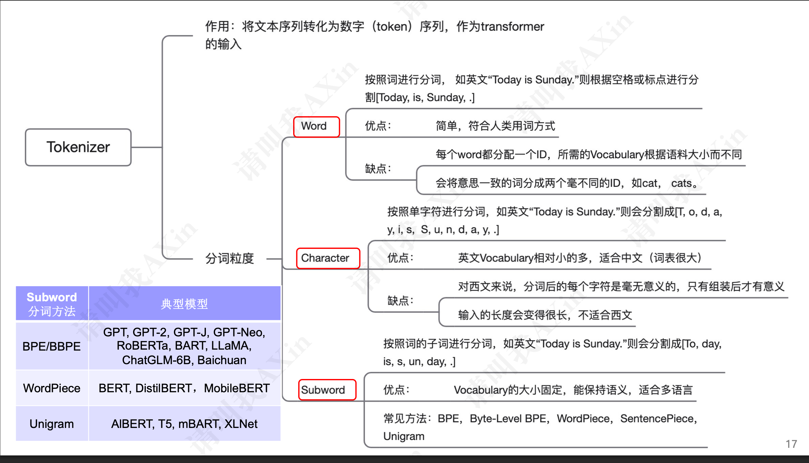

## Tokenizer

### 作用:

Tokenizer，即将输入的文本切分为独立的标记(token),每个token有对应的id; 需要将我们的文本输入转换为数字。

- 将文本序列转化为数字序列(token编号)，作为transformer的输入

  [tokenizer可视化](https://huggingface.co/spaces/Xenova/the-tokenizer-playground)

### 模型的输入:

对于文本模型来说，输入的是一个个数字，那么如何将文本转换为数字呢，那就是tokenizer的作用


### 分词方案:

**基于单词（Word-based）的 tokenization**

​	将文本划分为一个个词(包括标点)

​	优点： 符合人的自然语言和直觉

​	缺点： 

​		相同含义的词会划分为不同的token,主要在英文方面，比如dog和dogs, 另外词表会很大；

​        	一般来说会限制词表数量，未登陆词用unkown表示，但同时会导致部分词汇丢失信息，存在OOV(输入的词超出词表范围)问题。


**基于字符（Character-based）的 tokenization**

> 将文本划分为字符(包括标点)

优点：

   可以表示任意文本，不会出现OOV问题，对拉丁文语系来说，词表很小，例如英文只需要256个字符

缺点：

相对单词来说信息量非常低，模型性能一般很差

相对于 word-based 来说，会产生很长的 Token 序列

中文也需要很大一个词表

基于子词（subword）的 tokenization

> 常用词不应该再被切分成更小的 token 或子词（subword）
>
> 不常用的词或词群应该用子词来表示

使用 subword 划分符合英文词群，能够充分表意




### Subword tokenizers

#### BPE Tokenization

Byte-Pair Encoding(BPE)最初是作为一种文本压缩算法开发的，后来被 OpenAI 用于 GPT 模型预训练时的分词任务。许多 Transformer 模型都在使用这种算法，包括 GPT、GPT-2、RoBERTa、BART 和 DeBERTa。

https://huggingface.co/learn/llm-course/chapter6/5?fw=pt

##### BPE 训练

BPE 训练首先计算语料库中使用的唯一单词集合（在完成标准化和预分词步骤之后），然后取出用来编写这些词的所有符号来构建词汇表。举一个非常简单的例子，假设我们的语料库使用了这五个词：

```
"hug", "pug", "pun", "bun", "hugs"
```

基础单词集合将是 `["b", "g", "h", "n", "p", "s", "u"]` 。在实际应用中，基本词汇表将至少包含所有 ASCII 字符，可能还包含一些 Unicode 字符。如果你正在 tokenization 不在训练语料库中的字符，则该字符将转换为未知 tokens，这就是为什么许多 NLP 模型在分析带有表情符号的内容的结果非常糟糕的原因之一。

GPT-2 和 RoBERTa （这两者非常相似）的 tokenizer 有一个巧妙的方法来处理这个问题：他们不把单词看成是用 Unicode 字符编写的，而是用字节编写的。这样，基本词汇表的大小很小（256），但是能包含几乎所有你能想象的字符，而不会最终转换为未知 tokens 这个技巧被称为 `字节级（byte-level） BPE` 。

获得这个基础单词集合后，我们通过学习 `合并（merges）` 来添加新的 tokens 直到达到期望的词汇表大小。合并是将现有词汇表中的两个元素合并为一个新元素的规则。所以，一开始会创建出含有两个字符的 tokens 然后，随着训练的进展，会产生更长的子词。

在分词器训练期间的任何一步，BPE 算法都会搜索最常见的现有 tokens 对 （在这里，“对”是指一个词中的两个连续 tokens ）。最常见的这一对会被合并，然后我们重复这个过程。

回到我们之前的例子，让我们假设单词具有以下频率：

```
("hug", 10), ("pug", 5), ("pun", 12), ("bun", 4), ("hugs", 5)
```

意思是 `"hug"` 在语料库中出现了 10 次， `"pug"` 出现了 5 次， `"pun"` 出现了 12 次， `"bun"` 出现了 4 次， `"hugs"` 出现了 5 次。我们通过将每个单词拆分为字符（形成我们初始词汇表的字符）来开始训练，这样我们就可以将每个单词视为一个 tokens 列表：

```
("h" "u" "g", 10), ("p" "u" "g", 5), ("p" "u" "n", 12), ("b" "u" "n", 4), ("h" "u" "g" "s", 5)
```

然后我们看看相邻的字符对。 `("h", "u")` 在词 `"hug"` 和 `"hugs"` 中出现，所以在语料库中总共出现了 15 次。然而，最常见的对属于 `("u", "g")` ，它在 `"hug"` 、 `"pug"` 和 `"hugs"` 中出现，总共在词汇表中出现了 20 次。

因此，tokenizer 学习的第一个合并规则是 `("u", "g") -> "ug"` ，意思就是 `"ug"` 将被添加到词汇表中，且应在语料库的所有词中合并这一对。在这个阶段结束时，词汇表和语料库看起来像这样：

```
词汇表: ["b", "g", "h", "n", "p", "s", "u", "ug"]
语料库: ("h" "ug", 10), ("p" "ug", 5), ("p" "u" "n", 12), ("b" "u" "n", 4), ("h" "ug" "s", 5)
```

现在我们有一些对，继续合并的话会产生一个比两个字符长的 tokens 例如 `("h", "ug")` ，在语料库中出现 15 次。然而，这个阶段出现频率最高的对是 `("u", "n")` ，在语料库中出现 16 次，所以学到的第二个合并规则是 `("u", "n") -> "un"` 。将其添加到词汇表并合并所有现有的这个对，将出现：

```
词汇表: ["b", "g", "h", "n", "p", "s", "u", "ug", "un"]
语料库: ("h" "ug", 10), ("p" "ug", 5), ("p" "un", 12), ("b" "un", 4), ("h" "ug" "s", 5)
```

现在最频繁的一对是 `("h", "ug")` ，所以我们学习了合并规则 `("h", "ug") -> "hug"` ，这形成了我们第一个三个字母的 tokens 合并后，语料库如下所示：

```
词汇表: ["b", "g", "h", "n", "p", "s", "u", "ug", "un", "hug"]
语料库: ("hug", 10), ("p" "ug", 5), ("p" "un", 12), ("b" "un", 4), ("hug" "s", 5)
```

我们继续这样合并，直到达到我们所需的词汇量。

✏️ **现在轮到你了！** 你认为下一个合并规则是什么？

##### tokenization

完成训练之后就可以对新的输入 tokenization 了，从某种意义上说，新的输入会依照以下步骤对新输入进行 tokenization：

1. 标准化
2. 预分词
3. 将单词拆分为单个字符
4. 根据学习的合并规则，按顺序合并拆分的字符

让我们以我们在训练期间使用的示例为例，Tokenizer 学习到了三个合并规则：

```
("u", "g") -> "ug"
("u", "n") -> "un"
("h", "ug") -> "hug"
```

在这种情况下，单词 `"bug"` 将被转化为 `["b", "ug"]` 。然而 `"mug"` ，将被转换为 `["[UNK]", "ug"]` ，因为字母 `"m"` 不再基本词汇表中。同样，单词 `"thug"` 会被转换为 `["[UNK]", "hug"]` ：字母 `"t"` 不在基本词汇表中，使用合并规则首先会将 `"u"` 和 `"g"` 合并，然后将 `"h"` 和 `"ug"` 合并。

✏️ **现在轮到你了！** 你认为这个词 `"unhug"` 将如何被 tokenization？

##### 实现 BPE 算法

现在，让我们看一下 BPE 算法的实现。这并不是在大型语料库上实际使用的经过优化的版本；我们只是想向你展示代码，以便你可以更好地理解算法

首先，我们需要一个语料库，让我们创建一个含有几句话的简单语料库：

```
corpus = [
    "This is the Hugging Face Course.",
    "This chapter is about tokenization.",
    "This section shows several tokenizer algorithms.",
    "Hopefully, you will be able to understand how they are trained and generate tokens.",
]
```

接下来，我们需要将该语料库预分词为单词。由于我们正在复现一个 BPE tokenizer （例如 GPT-2），我们将使用 `gpt2` 分词器进行预分词：

```
from transformers import AutoTokenizer

tokenizer = AutoTokenizer.from_pretrained("gpt2")
```

然后，我们在进行预分词的同时计算语料库中每个单词的频率：

```
from collections import defaultdict

word_freqs = defaultdict(int)

for text in corpus:
    words_with_offsets = tokenizer.backend_tokenizer.pre_tokenizer.pre_tokenize_str(text)
    new_words = [word for word, offset in words_with_offsets]
    for word in new_words:
        word_freqs[word] += 1

print(word_freqs)
defaultdict(int, {'This': 3, 'Ġis': 2, 'Ġthe': 1, 'ĠHugging': 1, 'ĠFace': 1, 'ĠCourse': 1, '.': 4, 'Ġchapter': 1,
    'Ġabout': 1, 'Ġtokenization': 1, 'Ġsection': 1, 'Ġshows': 1, 'Ġseveral': 1, 'Ġtokenizer': 1, 'Ġalgorithms': 1,
    'Hopefully': 1, ',': 1, 'Ġyou': 1, 'Ġwill': 1, 'Ġbe': 1, 'Ġable': 1, 'Ġto': 1, 'Ġunderstand': 1, 'Ġhow': 1,
    'Ġthey': 1, 'Ġare': 1, 'Ġtrained': 1, 'Ġand': 1, 'Ġgenerate': 1, 'Ġtokens': 1})
```

下一步是计算基础词汇表，这由语料库中使用的所有字符组成：

```
alphabet = []

for word in word_freqs.keys():
    for letter in word:
        if letter not in alphabet:
            alphabet.append(letter)
alphabet.sort()

print(alphabet)
[ ',', '.', 'C', 'F', 'H', 'T', 'a', 'b', 'c', 'd', 'e', 'f', 'g', 'h', 'i', 'k', 'l', 'm', 'n', 'o', 'p', 'r', 's',
  't', 'u', 'v', 'w', 'y', 'z', 'Ġ']
```

我们还在该词汇表的开头添加了模型使用的特殊 tokens 对于 GPT-2，唯一的特殊 tokens 是 `"<|endoftext|>"` ：

```
vocab = ["<|endoftext|>"] + alphabet.copy()
```

我们现在需要将每个单词拆分为单独的字符，以便能够开始训练：

```
splits = {word: [c for c in word] for word in word_freqs.keys()}
```

现在我们已准备好进行训练，让我们编写一个函数来计算每对字符的频率。我们需要在训练的每个步骤中使用它：

```
def compute_pair_freqs(splits):
    pair_freqs = defaultdict(int)
    for word, freq in word_freqs.items():
        split = splits[word]
        if len(split) == 1:
            continue
        for i in range(len(split) - 1):
            pair = (split[i], split[i + 1])
            pair_freqs[pair] += freq
    return pair_freqs
```

让我们来看看这个字典在初始合并后的一些结果：

```
pair_freqs = compute_pair_freqs(splits)

for i, key in enumerate(pair_freqs.keys()):
    print(f"{key}: {pair_freqs[key]}")
    if i >= 5:
        break
('T', 'h'): 3
('h', 'i'): 3
('i', 's'): 5
('Ġ', 'i'): 2
('Ġ', 't'): 7
('t', 'h'): 3
```

现在，只需要一个简单的循环就可以找到出现频率最高的对：

```
best_pair = ""
max_freq = None

for pair, freq in pair_freqs.items():
    if max_freq is None or max_freq < freq:
        best_pair = pair
        max_freq = freq

print(best_pair, max_freq)
('Ġ', 't') 7
```

所以第一个要学习的合并规则是 `('Ġ', 't') -> 'Ġt'` ，我们将 `'Ġt'` 添加到词汇表：

```
merges = {("Ġ", "t"): "Ġt"}
vocab.append("Ġt")
```

接下来，我们需要在我们的 `splits` 字典中进行这个合并。让我们为此编写另一个函数：

```
def merge_pair(a, b, splits):
    for word in word_freqs:
        split = splits[word]
        if len(split) == 1:
            continue

        i = 0
        while i < len(split) - 1:
            if split[i] == a and split[i + 1] == b:
                split = split[:i] + [a + b] + split[i + 2 :]
            else:
                i += 1
        splits[word] = split
    return splits
```

我们可以观察一下第一次合并的结果：

```
splits = merge_pair("Ġ", "t", splits)
print(splits["Ġtrained"])
['Ġt', 'r', 'a', 'i', 'n', 'e', 'd']
```

现在我们有了我们需要的所有代码，可以循环直到我们学习到我们想要的所有合并。让我们把目标词汇表的大小设定为 50：

```
vocab_size = 50

while len(vocab) < vocab_size:
    pair_freqs = compute_pair_freqs(splits)
    best_pair = ""
    max_freq = None
    for pair, freq in pair_freqs.items():
        if max_freq is None or max_freq < freq:
            best_pair = pair
            max_freq = freq
    splits = merge_pair(*best_pair, splits)
    merges[best_pair] = best_pair[0] + best_pair[1]
    vocab.append(best_pair[0] + best_pair[1])
```

最终，我们学习了 19 条合并规则（初始词汇量为 31 —— 字母表中的 30 个字符，加上特殊 token ）：

```
print(merges)
{('Ġ', 't'): 'Ġt', ('i', 's'): 'is', ('e', 'r'): 'er', ('Ġ', 'a'): 'Ġa', ('Ġt', 'o'): 'Ġto', ('e', 'n'): 'en',
 ('T', 'h'): 'Th', ('Th', 'is'): 'This', ('o', 'u'): 'ou', ('s', 'e'): 'se', ('Ġto', 'k'): 'Ġtok',
 ('Ġtok', 'en'): 'Ġtoken', ('n', 'd'): 'nd', ('Ġ', 'is'): 'Ġis', ('Ġt', 'h'): 'Ġth', ('Ġth', 'e'): 'Ġthe',
 ('i', 'n'): 'in', ('Ġa', 'b'): 'Ġab', ('Ġtoken', 'i'): 'Ġtokeni'}
```

词汇表由特殊 token 初始字母和所有合并结果组成：

```
print(vocab)
['<|endoftext|>', ',', '.', 'C', 'F', 'H', 'T', 'a', 'b', 'c', 'd', 'e', 'f', 'g', 'h', 'i', 'k', 'l', 'm', 'n', 'o',
 'p', 'r', 's', 't', 'u', 'v', 'w', 'y', 'z', 'Ġ', 'Ġt', 'is', 'er', 'Ġa', 'Ġto', 'en', 'Th', 'This', 'ou', 'se',
 'Ġtok', 'Ġtoken', 'nd', 'Ġis', 'Ġth', 'Ġthe', 'in', 'Ġab', 'Ġtokeni']
```

💡 在同一语料库上使用 `train_new_from_iterator()` 可能不会产生完全相同的词汇表。这是因为当有多个出现频率最高的对时，我们选择遇到的第一个，而 🤗 Tokenizers 库根据内部 ID 选择第一个。

为了对新文本进行分词，我们对其进行预分词、拆分，然后使用学到的所有合并规则：

```
def tokenize(text):
    pre_tokenize_result = tokenizer._tokenizer.pre_tokenizer.pre_tokenize_str(text)
    pre_tokenized_text = [word for word, offset in pre_tokenize_result]
    splits = [[l for l in word] for word in pre_tokenized_text]
    for pair, merge in merges.items():
        for idx, split in enumerate(splits):
            i = 0
            while i < len(split) - 1:
                if split[i] == pair[0] and split[i + 1] == pair[1]:
                    split = split[:i] + [merge] + split[i + 2 :]
                else:
                    i += 1
            splits[idx] = split

    return sum(splits, [])
```

我们可以尝试在任何由字母表中的字符组成的文本上进行此操作：

```
tokenize("This is not a token.")
['This', 'Ġis', 'Ġ', 'n', 'o', 't', 'Ġa', 'Ġtoken', '.']
```


#### Byte-level BPE(BBPE) 改进版本

将字节(byte) 视为基本token, BPE是字符级别

两个字节合并即可表示Unicode，将中文、日文、阿拉伯文、表情符号等都进行统一


#### WordPiece Tokenization

https://huggingface.co/learn/llm-course/zh-CN/chapter6/6?fw=pt

WordPiece 是 Google 开发的用于 BERT 预训练的分词算法。自此之后，很多基于 BERT 的 Transformer 模型都复用了这种方法，比如 DistilBERT，MobileBERT，Funnel Transformers 和 MPNET。它在训练方面与 BPE 非常类似，但实际的分词方法有所不同。

##### WordPiece 训练

⚠️ Google 从未开源 WordPiece 训练算法的实现，因此以下是我们基于已发表文献的最佳猜测。它可能并非 100％ 准确的。

与BPE 一样，WordPiece 也是从包含模型使用的特殊 tokens 和初始字母表的小词汇表开始的。由于它是通过添加前缀（如 BERT 中的 `##` ）来识别子词的，每个词最初都会通过在词内部所有字符前添加该前缀进行分割。因此，例如 `"word"` 将被这样分割：

```
w ##o ##r ##d
```

因此，初始字母表包含所有出现在单词第一个位置的字符，以及出现在单词内部并带有 WordPiece 前缀的字符。

然后，同样像 BPE 一样，WordPiece 会学习合并规则。主要的不同之处在于合并对的选择方式。WordPiece 不是选择频率最高的对，而是对每对计算一个得分，使用以下公式：

score=(freq_of_pair)/(freq_of_first_element×freq_of_second_element)score=(freq_of_pair)/(freq_of_first_element×freq_of_second_element)

通过将两部分合在一起的频率除以其中各部分的频率的乘积，该算法优先合并那些在词汇表中单独出现出现的对。例如，即使 `("un", "##able")` 这对在词汇表中出现的频率很高，它也不一定会被合并，因为 `"un"` 和 `"##able"` 这两对可能会在很多其他词中出现，频率很高。相比之下，像 `("hu", "##gging")` 这样的对可能会更快地被合并（假设单词“hugging”在词汇表中出现的频率很高），因为 `"hu"` 和 `"##gging"` 可能分别出现的频率较低。

我们使用与 BPE 示例相同的词汇表：

```
("hug", 10), ("pug", 5), ("pun", 12), ("bun", 4), ("hugs", 5)
```

经过分割之后将会是：

```
("h" "##u" "##g", 10), ("p" "##u" "##g", 5), ("p" "##u" "##n", 12), ("b" "##u" "##n", 4), ("h" "##u" "##g" "##s", 5)
```

所以最初的词汇表将会是 `["b", "h", "p", "##g", "##n", "##s", "##u"]` （如果我们暂时忽略特殊 tokens ）。出现频率最高的一对是 `("##u", "##g")` （目前 20 次），但 `"##u"` 和其他单词一起出现的频率非常高，所以它的分数不是最高的（分数是 1 / 36）。所有带有 `"##u"` 的对实际上都有相同的分数（1 / 36），所以分数最高的对是 `("##g", "##s")` —— 唯一没有 `"##u"` 的对——分数是 1 / 20，所以学习的第一个合并是 `("##g", "##s") -> ("##gs")` 。

请注意，当我们合并时，我们会删除两个 tokens 之间的 `##` ，所以我们将 `"##gs"` 添加到词汇表中，并将语料库的单词按照改规则进行合并：

```
词汇表: ["b", "h", "p", "##g", "##n", "##s", "##u", "##gs"]
语料库: ("h" "##u" "##g", 10), ("p" "##u" "##g", 5), ("p" "##u" "##n", 12), ("b" "##u" "##n", 4), ("h" "##u" "##gs", 5)
```

此时， `"##u"` 出现在所有可能的对中，因此它们最终都具有相同的分数。在这种情况下，第一个对会被合并，于是我们得到了 `("h", "##u") -> "hu"` 规则：

```
词汇表: ["b", "h", "p", "##g", "##n", "##s", "##u", "##gs", "hu"]
语料库: ("hu" "##g", 10), ("p" "##u" "##g", 5), ("p" "##u" "##n", 12), ("b" "##u" "##n", 4), ("hu" "##gs", 5)
```

然后，下一个最佳得分的对是 `("hu", "##g")` 和 `("hu", "##gs")` （得分为 1/15，而所有其他配对的得分为 1/21），因此得分最高的第一对合并：

```
词汇表: ["b", "h", "p", "##g", "##n", "##s", "##u", "##gs", "hu", "hug"]
语料库: ("hug", 10), ("p" "##u" "##g", 5), ("p" "##u" "##n", 12), ("b" "##u" "##n", 4), ("hu" "##gs", 5)
```

然后我们就按此方式继续，直到我们达到所需的词汇表大小。

✏️ **现在轮到你了！** 下一个合并规则是什么？

##### tokenization 算法

WordPiece 和 BPE 的分词方式有所不同，WordPiece 只保存最终词汇表，而不保存学习到的合并规则。WordPiece 从待分词的词开始，找到词汇表中最长的子词，然后在其处分割。例如，如果我们使用上述示例中学习到的词汇表，对于词 `"hugs"` ，从开始处的最长子词在词汇表中是 `"hug"` ，所以我们在那里分割，得到 `["hug", "##s"]` 。然后我们继续处理 `"##s"` ，它在词汇表中，所以 `"hugs"` 的分词结果是 `["hug", "##s"]` 。

如果使用 BPE，我们会按照学习到的合并规则进行合并，并将其分词为 `["hu", "##gs"]` ，不同的字词分词算法所以最终得到的编码是不同的。

再举一个例子，让我们看看 `"bugs"` 将如何分词的。 `"b"` 是从词汇表中单词开头开始的最长子词，所以我们在那里分割并得到 `["b", "##ugs"]` 。然后 `"##u"` 是词汇表中从 `"##ugs"` 开始的最长的子词，所以我们在那里拆分并得到 `["b", "##u, "##gs"]` 。最后， `"##gs"` 在词汇表中，因此 `"bugs"` 的分词结果是： `["b", "##u, "##gs"]` 。

当分词过程中无法在词汇库中找到该子词时，整个词会被标记为 unknown（未知）—— 例如， `"mug"` 将被标记为 `["[UNK]"]` ， `"bum"` 也是如此（即使我们的词汇表中包含 `"b"` 和 `"##u"` 开始，但是 `"##m"` 不在词汇表中，因此最终的分词结果只会是 `["[UNK]"]` ，而不是 `["b", "##u", "[UNK]"]` ）。这是与 BPE 的另一个区别，BPE 只会将不在词汇库中的单个字符标记为 unknown。

✏️ **现在轮到你了！** `"pugs"` 将被如何分词？

##### 实现 WordPiece

现在让我们看一下 WordPiece 算法的实现。与 BPE 一样，这只是教学示例，你不能在大型语料库上使用。

我们将使用与 BPE 示例中相同的语料库：

```
corpus = [
    "This is the Hugging Face Course.",
    "This chapter is about tokenization.",
    "This section shows several tokenizer algorithms.",
    "Hopefully, you will be able to understand how they are trained and generate tokens.",
]
```

首先，我们需要将语料库预分词为单词。由于我们正在复刻 WordPiece tokenizer （如 BERT），因此我们将使用 `bert-base-cased` tokenizer 进行预分词：

```
from transformers import AutoTokenizer

tokenizer = AutoTokenizer.from_pretrained("bert-base-cased")
```

然后我们在进行预分词的同时，计算语料库中每个单词的频率：

```
from collections import defaultdict

word_freqs = defaultdict(int)
for text in corpus:
    words_with_offsets = tokenizer.backend_tokenizer.pre_tokenizer.pre_tokenize_str(text)
    new_words = [word for word, offset in words_with_offsets]
    for word in new_words:
        word_freqs[word] += 1

word_freqs
defaultdict(
    int, {'This': 3, 'is': 2, 'the': 1, 'Hugging': 1, 'Face': 1, 'Course': 1, '.': 4, 'chapter': 1, 'about': 1,
    'tokenization': 1, 'section': 1, 'shows': 1, 'several': 1, 'tokenizer': 1, 'algorithms': 1, 'Hopefully': 1,
    ',': 1, 'you': 1, 'will': 1, 'be': 1, 'able': 1, 'to': 1, 'understand': 1, 'how': 1, 'they': 1, 'are': 1,
    'trained': 1, 'and': 1, 'generate': 1, 'tokens': 1})
```

如我们之前看到的，字母表是一个独特的集合，由所有单词的第一个字母以及所有以 `##` 为前缀和在单词中的其他字母组成：

```
alphabet = []
for word in word_freqs.keys():
    if word[0] not in alphabet:
        alphabet.append(word[0])
    for letter in word[1:]:
        if f"##{letter}" not in alphabet:
            alphabet.append(f"##{letter}")

alphabet.sort()
alphabet

print(alphabet)
['##a', '##b', '##c', '##d', '##e', '##f', '##g', '##h', '##i', '##k', '##l', '##m', '##n', '##o', '##p', '##r', '##s',
 '##t', '##u', '##v', '##w', '##y', '##z', ',', '.', 'C', 'F', 'H', 'T', 'a', 'b', 'c', 'g', 'h', 'i', 's', 't', 'u',
 'w', 'y']
```

我们还在该词汇表的开头添加了模型使用的特殊 tokens，在使用 BERT 的情况下，特殊 tokens 是 `["[PAD]", "[UNK]", "[CLS]", "[SEP]", "[MASK]"]` ：

```
vocab = ["[PAD]", "[UNK]", "[CLS]", "[SEP]", "[MASK]"] + alphabet.copy()
```

接下来我们需要将每个单词进行分割，除了第一个字母外，其他字母都需要以 `##` 为前缀：

```
splits = {
    word: [c if i == 0 else f"##{c}" for i, c in enumerate(word)]
    for word in word_freqs.keys()
}
```

现在我们已经准备好训练了，让我们编写一个函数来计算每对的分数。我们需要在训练的每个步骤中使用它：

```
def compute_pair_scores(splits):
    letter_freqs = defaultdict(int)
    pair_freqs = defaultdict(int)
    for word, freq in word_freqs.items():
        split = splits[word]
        if len(split) == 1:
            letter_freqs[split[0]] += freq
            continue
        for i in range(len(split) - 1):
            pair = (split[i], split[i + 1])
            letter_freqs[split[i]] += freq
            pair_freqs[pair] += freq
        letter_freqs[split[-1]] += freq

    scores = {
        pair: freq / (letter_freqs[pair[0]] * letter_freqs[pair[1]])
        for pair, freq in pair_freqs.items()
    }
    return scores
```

让我们来看看在初始分割后的部分字典：

```
pair_scores = compute_pair_scores(splits)
for i, key in enumerate(pair_scores.keys()):
    print(f"{key}: {pair_scores[key]}")
    if i >= 5:
        break
('T', '##h'): 0.125
('##h', '##i'): 0.03409090909090909
('##i', '##s'): 0.02727272727272727
('i', '##s'): 0.1
('t', '##h'): 0.03571428571428571
('##h', '##e'): 0.011904761904761904
```

现在，只需要一个快速循环就可以找到得分最高的对：

```
best_pair = ""
max_score = None
for pair, score in pair_scores.items():
    if max_score is None or max_score < score:
        best_pair = pair
        max_score = score

print(best_pair, max_score)
('a', '##b') 0.2
```

所以第一个要学习的合并是 `('a', '##b') -> 'ab'` ，并且我们添加 `'ab'` 到词汇表中：

```
vocab.append("ab")
```

接下来，我们需要对 `splits` 字典进行这种合并。让我们为此写另一个函数：

```
def merge_pair(a, b, splits):
    for word in word_freqs:
        split = splits[word]
        if len(split) == 1:
            continue
        i = 0
        while i < len(split) - 1:
            if split[i] == a and split[i + 1] == b:
                merge = a + b[2:] if b.startswith("##") else a + b
                split = split[:i] + [merge] + split[i + 2 :]
            else:
                i += 1
        splits[word] = split
    return splits
```

我们可以看看第一次合并的结果：

```
splits = merge_pair("a", "##b", splits)
splits["about"]
['ab', '##o', '##u', '##t']
```

现在我们有了合并循环的所有代码。让我们设定词汇表的大小为 70：

```
vocab_size = 70
while len(vocab) < vocab_size:
    scores = compute_pair_scores(splits)
    best_pair, max_score = "", None
    for pair, score in scores.items():
        if max_score is None or max_score < score:
            best_pair = pair
            max_score = score
    splits = merge_pair(*best_pair, splits)
    new_token = (
        best_pair[0] + best_pair[1][2:]
        if best_pair[1].startswith("##")
        else best_pair[0] + best_pair[1]
    )
    vocab.append(new_token)
```

然后我们可以查看生成的词汇表：

```
print(vocab)
['[PAD]', '[UNK]', '[CLS]', '[SEP]', '[MASK]', '##a', '##b', '##c', '##d', '##e', '##f', '##g', '##h', '##i', '##k',
 '##l', '##m', '##n', '##o', '##p', '##r', '##s', '##t', '##u', '##v', '##w', '##y', '##z', ',', '.', 'C', 'F', 'H',
 'T', 'a', 'b', 'c', 'g', 'h', 'i', 's', 't', 'u', 'w', 'y', 'ab','##fu', 'Fa', 'Fac', '##ct', '##ful', '##full', '##fully',
 'Th', 'ch', '##hm', 'cha', 'chap', 'chapt', '##thm', 'Hu', 'Hug', 'Hugg', 'sh', 'th', 'is', '##thms', '##za', '##zat',
 '##ut']
```

如我们所见，相较于 BPE（字节对编码），此分词器在学习单词部分作为 tokens 时稍快一些。

💡 在同一语料库上使用 `train_new_from_iterator()` 不会产生完全相同的词汇表。这是因为 🤗 Tokenizers 库没有为训练实现 WordPiece（因为我们不完全确定它的真实实现方式），而是使用了 BPE。

要对新文本进行分词，我们先预分词，再进行分割，然后在每个词上使用分词算法。也就是说，我们寻找从第一个词开始的最大子词并将其分割，然后我们对第二部分重复此过程，以此类推，对该词以及文本中的后续词进行分割：

```
def encode_word(word):
    tokens = []
    while len(word) > 0:
        i = len(word)
        while i > 0 and word[:i] not in vocab:
            i -= 1
        if i == 0:
            return ["[UNK]"]
        tokens.append(word[:i])
        word = word[i:]
        if len(word) > 0:
            word = f"##{word}"
    return tokens
```

让我们使用词汇表中的一个词和一个不在词汇表中的词上测试一下：

```
print(encode_word("Hugging"))
print(encode_word("HOgging"))
['Hugg', '##i', '##n', '##g']
['[UNK]']
```

现在，让我们编写一个对文本分词的函数：

```
def tokenize(text):
    pre_tokenize_result = tokenizer._tokenizer.pre_tokenizer.pre_tokenize_str(text)
    pre_tokenized_text = [word for word, offset in pre_tokenize_result]
    encoded_words = [encode_word(word) for word in pre_tokenized_text]
    return sum(encoded_words, [])
```

我们可以在任何文本上尝试：

```
tokenize("This is the Hugging Face course!")
['Th', '##i', '##s', 'is', 'th', '##e', 'Hugg', '##i', '##n', '##g', 'Fac', '##e', 'c', '##o', '##u', '##r', '##s',
 '##e', '[UNK]']
```


通过将 pair 的频率除以其单个 token 的频率的乘积，该算法优先考 虑单个token 在词表中不太频繁的 pair 进行合并

$pair得分=\frac{pair出现的次数}{token_1出现的次数\times token2出现的次数}$

例如，它不一定会合并（“un”、“##able”），即使这对词在词汇表中出 现得很频繁，因为“un”和“###able”这两对词可能都会出现在很多其他单 词中，并且频率很高。相比之下，像（“hu”、“##gging”）这样的一对可 能会更快地融合（假设“hugging”一词经常出现在词汇表中），因为 “hu”和“##ggig”单独出现的频率可能较低。 请


#### Unigram Tokenization

https://huggingface.co/learn/llm-course/chapter6/7?fw=pt

The Unigram algorithm is used in combination with [SentencePiece](https://huggingface.co/papers/1808.06226), which is the tokenization algorithm used by models like AlBERT, T5, mBART, Big Bird, and XLNet.

Unigram 算法常用于 SentencePiece 中，该切分算法被 AlBERT，T5，mBART，Big Bird 和 XLNet 等模型广泛采用。

SentencePiece addresses the fact that not all languages use spaces to separate words. Instead, SentencePiece treats the input as a raw input stream which includes the space in the set of characters to use. Then it can use the Unigram algorithm to construct the appropriate vocabulary.

##### Unigram 训练

与BPE 和 WordPiece 相比，Unigram 的工作方式正好相反：它从一个大词汇库开始，然后逐步删除词汇，直到达到目标词汇库大小。构建基础词汇库有多种方法：例如，我们可以选取预切分词汇中最常见的子串，或者在具有大词汇量的初始语料库上进行 BPE 得到一个初始词库。

在训练的每一步，Unigram 算法都会在给定当前词汇的情况下计算语料库的损失。然后，对于词汇表中的每个符号，算法计算如果删除该符号，整体损失会增加多少，并寻找删除后损失增加最少的符号。这些符号对语料库的整体损失影响较小，因此从某种意义上说，它们“相对不必要”并且是移除的最佳候选者。

这个过程非常消耗计算资源，因此我们不只是删除与最低损失增长相关的单个符号，而是删除与最低损失增长相关的百分之/p （p 是一个可以控制的超参数，通常是 10 或 20）的符号。然后重复此过程，直到词汇库达到所需大小。

注意，我们永远不会删除基础的单个字符，以确保任何词都能被切分。

然而，这仍然有些模糊：算法的主要部分是在词汇库中计算语料库的损失并观察当我们从词汇库中移除一些符号时损失如何变化，但我们尚未解释如何做到这一点。这一步依赖于 Unigram 模型的切分算法，接下来我们将深入研究。

我们将复用前面例子中的语料库：

```
("hug", 10), ("pug", 5), ("pun", 12), ("bun", 4), ("hugs", 5)
```

而在这个例子中，我们将取这个语料库中所有的子串作为初始词汇库：

```
["h", "u", "g", "hu", "ug", "p", "pu", "n", "un", "b", "bu", "s", "hug", "gs", "ugs"]
```

##### tokenization 算法

Unigram 模型是一种语言模型，它认为每个符号都与其之前的符号独立。这是最简单的语言模型，因此给定之前的上下文情况下，符号 X 的概率就是符号 X 的概率。所以，如果我们使用 Unigram 语言模型来生成文本，我们的预测总会输出最常见的符号。

给定符号的概率是其在原始语料库中的频率（我们计算它出现的次数），除以词汇库中所有符号的频率总和（以确保概率总和为 1）。例如， `"ug"` 出现在 `"hug"` ， `"pug"` 和 `"hugs"` 中，所以它在我们的语料库中的频率是 20。

以下是词汇库中所有可能出现子词的频率：

```
("h", 15) ("u", 36) ("g", 20) ("hu", 15) ("ug", 20) ("p", 17) ("pu", 17) ("n", 16)
("un", 16) ("b", 4) ("bu", 4) ("s", 5) ("hug", 15) ("gs", 5) ("ugs", 5)
```

所以，所有频率之和为 210，子词 `"ug"` 出现的概率是 20/210。

✏️ **现在轮到你了！** 编写代码计算上述频率，然后验证结果的准确性，以及概率的总和是否正确。

现在，为了对一个给定的单词进行分词，我们会查看所有可能的分词组合，并根据 Unigram 模型计算出每种可能的概率。由于所有的分词都被视为独立的，因此这个单词分词的概率就是每个子词概率的乘积。例如，将 `"pug"` 分词为 `["p", "u", "g"]` 的概率为：

P([‘‘p",‘‘u",‘‘g"])=P(‘‘p")×P(‘‘u")×P(‘‘g")=5210×36210×20210=0.000389*P*([‘‘*p*",‘‘*u*",‘‘*g*"])=*P*(‘‘*p*")×*P*(‘‘*u*")×*P*(‘‘*g*")=2105×21036×21020=0.000389

相比之下，将 “pug” 分词为 `["pu", "g"]` 的概率为：P([‘‘pu",‘‘g"])=P(‘‘pu")×P(‘‘g")=5210×20210=0.0022676*P*([‘‘*p**u*",‘‘*g*"])=*P*(‘‘*p**u*")×*P*(‘‘*g*")=2105×21020=0.0022676

因此，后者的可能性更大。一般来说，分词数最少的分词方式将具有最高的概率（因为每个分词都要除以 210），这正符合我们的直觉：将一个词分割为尽可能少的子词。

利用 Unigram 模型对一个词进行分词，就是找出概率最高的分词方式。以 `"pug"` 为例，我们得到的各种可能分词方式的概率如下：

```
["p", "u", "g"] : 0.000389
["p", "ug"] : 0.0022676
["pu", "g"] : 0.0022676
```

因此， `"pug"` 将被分词为 `["p", "ug"]` 或 `["pu", "g"]` ，取决于哪种分词方式排在前面（注意，在更大的语料库中，像这样的相等情况将很少见）。

在这个例子中，找出所有可能的分词方式并计算其概率是容易的，但在语料库比较大的情况下有些困难。有一个经典的算法可以用来计算这个概率，叫做 `Viterbi 算法` 。事实上，我们可以通过创建一个图来表示一个给定单词的所有可能分词，如果从字符 `a` 到字符 `b` 的子词在词汇表中，那么就存在一个从 `a` 到 `b` 的分支，分支的边就是进行这个切分的概率。

为了在图中找到得分最高的路径，Viterbi 算法会确定出每个位置上结束的最佳得分分割。我们从头到尾进行处理，可以通过遍历所有在当前位置结束的子词，然后使用这个子词开始位置的最佳得分，找到最高得分。然后，我们只需要回溯走过的路径，就能找到最终的最优路径。

让我们看一个使用我们的词汇表和单词 `"unhug"` 的例子。对于每个位置，最佳切分子词的分数如下：

```
Character 0 (u): "u" (score 0.171429)
Character 1 (n): "un" (score 0.076191)
Character 2 (h): "un" "h" (score 0.005442)
Character 3 (u): "un" "hu" (score 0.005442)
Character 4 (g): "un" "hug" (score 0.005442)
```

因此 “unhug” 将被分词为 `["un", "hug"]` 。

✏️ **现在轮到你了！** 确定单词 “huggun” 的分词方式以及其得分。

##### 回到训练

我们已经了解了如何进行分词处理，接下来我们可以更详细地了解一下在训练过程中如何计算损失值。在训练的每个阶段，我们都会将语料库中的每个词进行分词，分词所使用的词表和 Unigram 模型是基于目前的情况（即根据每个词在语料库中出现的频率）来确定的。然后，基于这种分词结果，我们就可以计算出损失值（loss）。

语料库中的每个词都有一个分数，损失（loss）值是这些分数的负对数似然 —— 即所有词的语料库中所有词的 `-log(P(word))` 总和

让我们回到我们的例子，以下是我们的语料库：

```
("hug", 10), ("pug", 5), ("pun", 12), ("bun", 4), ("hugs", 5)
```

每个单词的分词及其相应的得分如下：

```
"hug": ["hug"] (score 0.071428)
"pug": ["pu", "g"] (score 0.007710)
"pun": ["pu", "n"] (score 0.006168)
"bun": ["bu", "n"] (score 0.001451)
"hugs": ["hug", "s"] (score 0.001701)
```

因此，损失值（loss）是：

```
10 * (-log(0.071428)) + 5 * (-log(0.007710)) + 12 * (-log(0.006168)) + 4 * (-log(0.001451)) + 5 * (-log(0.001701)) = 169.8
```

现在，我们需要计算移除每个 token 对损失值的影响。这个过程颇为繁琐，所以我们这里仅对两个单词进行演示，在我们编写代码来协助处理这个过程时，再对全部的词进行 tokenization 的处理。在这个（非常）特殊的例子中，我们对单词的两种等效的分词方式：例如，“pug”可以被分词为 `["pu", "g"]` ，也可以被分词为 `["p", "ug"]` ，获得的分数是相同的。因此，去除词汇表中的 `"pu"` 损失值还会是一样的。

但是，去除 `"hug"` 之后，损失会变得更糟，因为 `"hug"` 和 `"hugs"` 的 tokenization 会变成：

```
"hug": ["hu", "g"] (score 0.006802)
"hugs": ["hu", "gs"] (score 0.001701)
```

这些变化将导致损失增加：

```
- 10 * (-log(0.071428)) + 10 * (-log(0.006802)) = 23.5
```

因此， `"pu"` tokens 可能会从词汇表中移除，但 `"hug"` 则不会。

##### 实现 Unigram

现在让我们在代码中实现上面看到的所内容。与 BPE 和 WordPiece 一样，这不是 Unigram 算法的高效实现（恰恰相反，这套代码的效率非常低），但它应该可以帮助你更好地理解它。

我们将使用与之前相同的语料库作为示例：

```
corpus = [
    "This is the Hugging Face Course.",
    "This chapter is about tokenization.",
    "This section shows several tokenizer algorithms.",
    "Hopefully, you will be able to understand how they are trained and generate tokens.",
]
```

这次，我们将使用 `xlnet-base-cased` 作为我们的模型：

```
from transformers import AutoTokenizer

tokenizer = AutoTokenizer.from_pretrained("xlnet-base-cased")
```

与 BPE 和 WordPiece 一样，我们首先计算语料库中每个单词的出现次数：

```
from collections import defaultdict

word_freqs = defaultdict(int)
for text in corpus:
    words_with_offsets = tokenizer.backend_tokenizer.pre_tokenizer.pre_tokenize_str(text)
    new_words = [word for word, offset in words_with_offsets]
    for word in new_words:
        word_freqs[word] += 1

word_freqs
```

然后，我们需要将我们的词汇表初始化为大于我们最终想要的词汇量。我们必须包含所有基本的单个字符（否则我们将无法对每个单词赋予一个 token ），但对于较大的子字符串，我们将只保留最常见的字符，因此我们按出现频率对它们进行排序：

```
char_freqs = defaultdict(int)
subwords_freqs = defaultdict(int)
for word, freq in word_freqs.items():
    for i in range(len(word)):
        char_freqs[word[i]] += freq
        # 循环遍历长度至少为2的子字
        for j in range(i + 2, len(word) + 1):
            subwords_freqs[word[i:j]] += freq

# 按频率对子词排序
sorted_subwords = sorted(subwords_freqs.items(), key=lambda x: x[1], reverse=True)
sorted_subwords[:10]
[('▁t', 7), ('is', 5), ('er', 5), ('▁a', 5), ('▁to', 4), ('to', 4), ('en', 4), ('▁T', 3), ('▁Th', 3), ('▁Thi', 3)]
```

我们用最优的子词对字符进行分组，以获得大小为 300 的初始词汇表：

```
token_freqs = list(char_freqs.items()) + sorted_subwords[: 300 - len(char_freqs)]
token_freqs = {token: freq for token, freq in token_freqs}
```

💡 SentencePiece 使用一种名为增强后缀数组（ESA）的更高效的算法来创建初始词汇表。

接下来，我们需要计算所有频率的总和，将频率转化为概率。在我们的模型中，我们将存储概率的对数，因为相较于小数相乘，对数相加在数值上更稳定，而且这将简化模型损失的计算：

```
from math import log

total_sum = sum([freq for token, freq in token_freqs.items()])
model = {token: -log(freq / total_sum) for token, freq in token_freqs.items()}
```

现在，主函数是使用 Viterbi 算法对单词进行分词。像我们之前看到的那样，这个算法会计算出每个词的最好的分割方式，我们把这个结果保存在一个叫做 `best_segmentations` 的变量里。我们会为词的每一个位置（从 0 开始，一直到词的总长度）都保存一个字典，字典里有两个键：最好的分割中最后一个词的起始位置，以及最好的分割的得分。有了最后一个词的起始位置，当我们把整个列表都填满后，我们就能找到完整的分割方式。

我们只需要两个循环就可以填充这个列表：一个主循环用来遍历每个可能的开始位置，第二个循环则试着找出所有以这个开始位置开始的子串。如果这个子串在我们的词表里，那么我们就找到了一个新的分词方式，这个分词方式会在当前位置结束。然后，我们会把这个新的分词方式和 `best_segmentations` 里的内容进行比较。

当主循环结束后，我们就从词的最后一个位置开始，然后一步步往前跳，跳过的每一步，我们都会记录下来，直到我们回到词的开头。

```
def encode_word(word, model):
    best_segmentations = [{"start": 0, "score": 1}] + [
        {"start": None, "score": None} for _ in range(len(word))
    ]
    for start_idx in range(len(word)):
        # best_score_at_start应该由循环的前面的步骤计算和填充
        best_score_at_start = best_segmentations[start_idx]["score"]
        for end_idx in range(start_idx + 1, len(word) + 1):
            token = word[start_idx:end_idx]
            if token in model and best_score_at_start is not None:
                score = model[token] + best_score_at_start
                # 如果我们发现以 end_idx 结尾的更好分段,我们会更新
                if (
                    best_segmentations[end_idx]["score"] is None
                    or best_segmentations[end_idx]["score"] > score
                ):
                    best_segmentations[end_idx] = {"start": start_idx, "score": score}

    segmentation = best_segmentations[-1]
    if segmentation["score"] is None:
        # 我们没有找到单词的 tokens  -> unknown
        return ["<unk>"], None

    score = segmentation["score"]
    start = segmentation["start"]
    end = len(word)
    tokens = []
    while start != 0:
        tokens.insert(0, word[start:end])
        next_start = best_segmentations[start]["start"]
        end = start
        start = next_start
    tokens.insert(0, word[start:end])
    return tokens, score
```

我们已经可以在一些词上尝试我们的初始模型：

```
print(encode_word("Hopefully", model))
print(encode_word("This", model))
(['H', 'o', 'p', 'e', 'f', 'u', 'll', 'y'], 41.5157494601402)
(['This'], 6.288267030694535)
```

现在，计算语料库上的分词损失就很简单了！

```
def compute_loss(model):
    loss = 0
    for word, freq in word_freqs.items():
        _, word_loss = encode_word(word, model)
        loss += freq * word_loss
    return loss
```

我们可以检查一下我们的模型是否有效：

```
compute_loss(model)
413.10377642940875
```

计算每个词的分数也并非难事；我们只需要计算通过删除每个词得到的模型的损失：

```
import copy


def compute_scores(model):
    scores = {}
    model_loss = compute_loss(model)
    for token, score in model.items():
        # 我们将保留长度为 1 的 tokens
        if len(token) == 1:
            continue
        model_without_token = copy.deepcopy(model)
        _ = model_without_token.pop(token)
        scores[token] = compute_loss(model_without_token) - model_loss
    return scores
```

我们可以试试看对于给定的词是否有效：

```
scores = compute_scores(model)
print(scores["ll"])
print(scores["his"])
```

因为 `"ll"` 这个子词在 `"Hopefully"` 这个词的分词中被使用了，如果我们把它删掉，我们可能会需要用两个 `"l"` 来代替，所以我们预计它会导致损失值增加。而 `"his"` 这个词只在 `"This"` 这个词里面被使用，而且 `"This"` 是作为一个完整的词被分割的，所以我们预计删除它的损失值变化会是零。下面就是实验结果：

```
6.376412403623874
0.0
```

💡 这种方式效率非常低，所以 SentencePiece 使用了一种估算方法来计算如果没有 X token，模型的损失会是多少：它不是重新开始，而是只是用剩下的词表里 X token 的分词方式来替代它。这样，所有的得分都能在和模型损失一起的同时计算出来。

至此，我们需要做的最后一件事就是将模型使用的特殊 tokens 添加到词汇表中，然后循环直到我们从词汇表中剪除足够多的 tokens 以达到我们期望的规模：

```
percent_to_remove = 0.1
while len(model) > 100:
    scores = compute_scores(model)
    sorted_scores = sorted(scores.items(), key=lambda x: x[1])
    # 删除分数最低的percent_to_remov tokens 。
    for i in range(int(len(model) * percent_to_remove)):
        _ = token_freqs.pop(sorted_scores[i][0])

    total_sum = sum([freq for token, freq in token_freqs.items()])
    model = {token: -log(freq / total_sum) for token, freq in token_freqs.items()}
```

然后，要对某些文本进行 tokenization，我们只需进行预分词然后使用我们的 `encode_word()` 函数：

```
def tokenize(text, model):
    words_with_offsets = tokenizer.backend_tokenizer.pre_tokenizer.pre_tokenize_str(text)
    pre_tokenized_text = [word for word, offset in words_with_offsets]
    encoded_words = [encode_word(word, model)[0] for word in pre_tokenized_text]
    return sum(encoded_words, [])


tokenize("This is the Hugging Face course.", model)
['▁This', '▁is', '▁the', '▁Hugging', '▁Face', '▁', 'c', 'ou', 'r', 's', 'e', '.']
```

至此 Unigram 的介绍完毕！期望此刻你已感觉自身如同领域的专家一般。在下一节中，我们将深入探讨🤗Tokenizers 库的基本构造模块，并展示如何使用它们构建自己的 tokenizer


Chat_template

```jinja2
{# Initialize default for add_generation_prompt if undefined #}

  


{# Namespace for state tracking variables #}


{# Process system messages first #}

  
    
      
      
    
      
    
  


{# Output beginning and system content #}
{{ bos_token }}{{ ns.system_prompt }}

{# Process conversation messages #}

  {# USER MESSAGE #}
  
    
    '' + {{ message['content'] }}

  {# ASSISTANT TOOL CALLS #}
  
    
    
      
        '▍' + {{ tool['type'] }} + '▚' + {{ tool['function']['name'] }} + '\n```json\n' + {{ tool['function']['arguments'] }} + '\n```' + ' ▞'
        
      
        '\n▍' + {{ tool['type'] }} + '▚' + {{ tool['function']['name'] }} + '\n```json\n' + {{ tool['function']['arguments'] }} + '\n```' + ' ▞'
        '▌'
      
    

  {# ASSISTANT TEXT RESPONSE #}
  
    
      '▌' + {{ message['content'] }} + ''
    
      '▌' + {{ message['content'] }} + ''
    
    

  {# TOOL OUTPUT #}
  
    
    
      ' ▚▚' + {{ message['content'] }} + ' ▞'
      
    
      '\n▍' + {{ message['content'] }} + ' ▞'
    
  


{# Trailing generation prompts #}

  '▌'


  '▌'

```


https://www.bilibili.com/video/BV1Fc411C7sz/?spm_id_from=333.337.search-card.all.click
